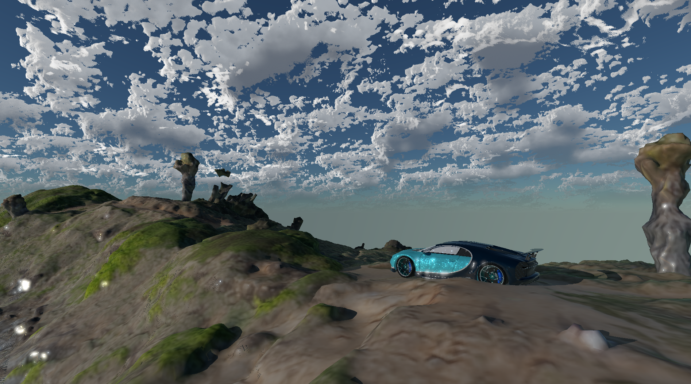

# Final Projects

<!--
Add in order of Team Numbers per the Final Project Team Sheet.

Template:
{:class="img-final-projects"} (you can also use gifs)

* [**Project Title**](project-link) -- [Team Member 1 Name](team-member-1-website), [Team Member 2 Name](team-member-2-website), [Team Member 2 Name](team-member-2-website)

Example:

{:class="img-final-projects"}
* [**SurfelPlus: Real-time Global Illumination Based on Surfels**](https://github.com/WANG-Ruipeng/SurfelPlus) -- [Zhen Ren](https://github.com/ZhiQing-R), [Ruipeng Wang](https://github.com/WANG-Ruipeng), [Jinxiang Wang](https://github.com/JinxiangW)
-->

{:class="img-final-projects"}
* [**RealiFluid: Interactive Realtime LBM Fluid Simulation in Unreal Engine**](https://github.com/LBM-Unreal/UnrealPlugin-LBM) -- [Henry Han](https://github.com/SirEnri2001), [Yu Jiang](https://github.com/NMDWSM0), [Zhanbo Lin](https://github.com/skszb)

{:class="img-final-projects"}
* [**Cumulus - RealTime Cloudscapes in DirectX12**](https://github.com/rubenaryo/Cumulus) -- [Ruben Young](https://www.rubenaryo.com/), [Jacky Park](https://jackypark.com/), [Eli Asimow](https://easimow.com/), [Avi Serebrenik](https://aviserebrenik.wixsite.com/cvsite)

{:class="img-final-projects"}
* [**WebGPU based Video Generation**](https://github.com/WebGPU-Video-Diffusion/WebGPU-Video-Diffusion) -- [Lobi Zhao](https://github.com/lobizhao), [Jiangman Zhao](https://github.com/JiangmanZhao), [Yuntian Ke](https://github.com/kytttt), [Ruichi Zhang](https://github.com/Pabloo0610)

{:class="img-final-projects"}
* [**glRemix: DX12 Remastering Platform for OpenGL 1.0 Apps**](https://github.com/glRemix/glRemix) -- [Anya Agarwal](https://anya0402.github.io/), [Aaron Tian](https://aarontian-stack.github.io/), [Amy Liu](amyliu.dev), [Bryce Joseph](https://github.com/brycej217)

{:class="img-final-projects"}
* [**MatForge**](https://github.com/MatForge/MatForge) -- [Cecilia Chen](https://www.linkedin.com/in/yue-chen-643182223/), [Xiaonan Pan](https://www.linkedin.com/in/xiaonan-pan-9b0b0b1a7/), [Yiding Tian](https://tonyxtian.com)

{:class="img-final-projects"}
* [**RACECAR: real-time Vulkan renderer suited for cars and racing games**](https://github.com/upgrade-central-tech/racecar) -- [Charles Wang](https://charleszw.com), [Anthony Ge](https://www.geant.pro), [Saahil Gupta](https://www.saahil-gupta.com), [Aaron Jiang](https://aaron-jiang.com)

* [**WebGPU Flowing Shallow Waves**](https://github.com/TianhongZhou/CIS-565-Final-Proj) -- [Qirui Fu](https://github.com/QiruiFU), [Pavel Peev](https://github.com/thesquashedman), [Tianhong Zhou](https://github.com/TianhongZhou)

* [**SimuNet**](https://github.com/sagescherrytree/SimuNet/) -- [Griffin Evans](http://evanses.com/griffin), [Jackie Guan](https://jackieguan.com/), [Jackie Li](https://sites.google.com/seas.upenn.edu/jacquelineli/home)
